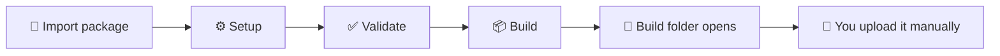

<div align="center">

# Store Release Toolkit

### Steam and Epic builds, without the publishing headache 🎮

[](https://unity.com/releases/editor/whats-new/6000.0.58f2)


Configure the store bits, catch problems early, and get a clean build folder ready for manual upload.

[Download the Unity package](./Assets/Store%20Release%20Toolkit%201.0.0.unitypackage) · [Browse the toolkit source](./Assets/Aroko/StoreReleaseToolkit/) · [Read the API guide](./Assets/Aroko/StoreReleaseToolkit/Documentation/API.md)

</div>

---

## So, what does it do?

The Store Release Toolkit keeps the Unity side of a Steam or Epic release in one friendly window. It detects the SDKs, helps fill in the store configuration, validates the project, and creates a store-specific Windows x64 build.

When the build finishes, the output folder opens automatically. There is also an **Open Folder** button if you want to jump back to it later.



> [!IMPORTANT]
> This is intentionally a **build-only** tool. It never signs in to Steam or Epic developer accounts, stores publishing credentials, runs upload tools, or sends a build to a storefront.

## The toolkit window

Open it from **Window > Store Release Toolkit**.

| Area | What you do there |
|---|---|
| **⚙️ Setup** | Install or detect vendor SDKs, enter store IDs, choose an icon, and configure Epic environments. |
| **📦 Build** | Pick a store profile and version, validate it, and create the Windows x64 build. |
| **🩺 Diagnostics** | See exactly what is ready and what still needs attention. |
| **🧑‍💻 API** | Browse the useful runtime/editor APIs and see how often each API is used in your codebase. |

Build and Diagnostics stay locked until Setup is ready, so you do not have to discover missing configuration halfway through a release build.

## Quick start

1. Download [Store Release Toolkit 1.0.0.unitypackage](./Assets/Store%20Release%20Toolkit%201.0.0.unitypackage).
2. Import it into a Unity `6000.0.58f2` project.
3. Open **Window > Store Release Toolkit**.
4. In Setup, press **Download** for Steamworks.NET or the EOS Unity Plugin. The toolkit installs the selected package for you.
5. Add the IDs and settings for the store you plan to build.
6. Choose a profile in Build, set the version, and press **Build**.
7. Upload the finished folder yourself through the normal Steam or Epic release workflow.

No SDKs are bundled in this repository. They remain external dependencies and are only installed when you ask for them.

## Store profiles

| Steam | Epic |
|---|---|
| **Steam Release** | **Epic Development** |
|  | **Epic Stage** |
|  | **Epic Live** |

Steam stays simple with one release profile. Epic keeps separate environments because its Product, Sandbox, Deployment, and EOS connection values can differ between Development, Stage, and Live.

Each build packages only the matching store integration. The inactive vendor SDK is isolated from the build.

## One achievement call for both stores 🏆

Use the same project-owned achievement ID in the Steam and Epic portals, then call one API from the game:

```csharp
using Aroko.StoreRelease.Runtime;

public static class GameAchievementIds
{
    public const string FirstWin = "first-win";
    public const string FinishedGame = "finished-game";
}

// The active Steam or Epic provider handles the rest.
StoreAchievements.Unlock(GameAchievementIds.FirstWin);
```

Unlock requests are saved locally before delivery and retried automatically. Steam builds use the Steam provider; Epic builds use the EOS provider. Your gameplay code does not need separate achievement calls for each store.

> Epic player authentication used by a shipped game is separate from developer-account login. The toolkit does not log developers into Epic or Steam.

## What gets produced?

A successful run gives you a normal local Windows x64 build folder containing:

- Your executable and Unity player files
- The correct store SDK integration
- Steam App ID data for a Steam build
- Generated EOS configuration and optional bootstrapper data for an Epic build
- A readable build report

It does **not** create publishing scripts, SteamPipe VDF files, BuildPatchTool commands, or upload credentials.

## Editor API

The build coordinator is available to editor tooling and CI:

```csharp
using Aroko.StoreRelease.Editor;

var request = new StoreBuildRequest(
    profile,
    "1.2.3",
    "Builds/Steam/1.2.3");

StoreOperationReport validation = StoreBuildCoordinator.Validate(request);
StoreOperationReport build = StoreBuildCoordinator.Build(request);
```

The CLI surface is deliberately small: `validate` and `build`. See the [CI guide](./Assets/Aroko/StoreReleaseToolkit/Documentation/CI.md) for command-line options.

## Repository layout

```text
Assets/
├── Aroko/StoreReleaseToolkit/           # Imported, readable toolkit source
└── Store Release Toolkit 1.0.0.unitypackage
                                          # Portable package for another project
Packages/                                  # Clean Unity package manifest
ProjectSettings/                           # Unity 6000.0.58f2 showcase project
```

## A tiny release checklist

- [ ] Setup shows the selected store as ready
- [ ] The correct profile and version are selected
- [ ] Diagnostics has no blocking errors
- [ ] The build completes and its folder opens
- [ ] The inactive store SDK is absent from the output
- [ ] The build is tested through the store client
- [ ] The finished folder is uploaded manually

---

<div align="center">

Built to make the Unity part of store releases a little calmer. ☕

</div>
